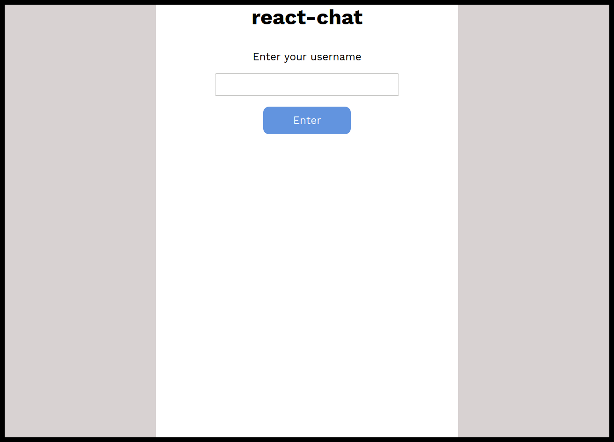
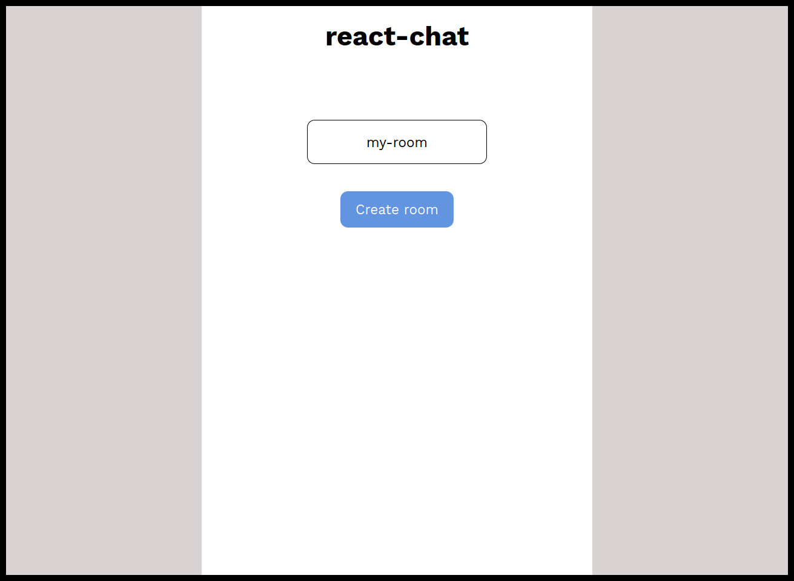
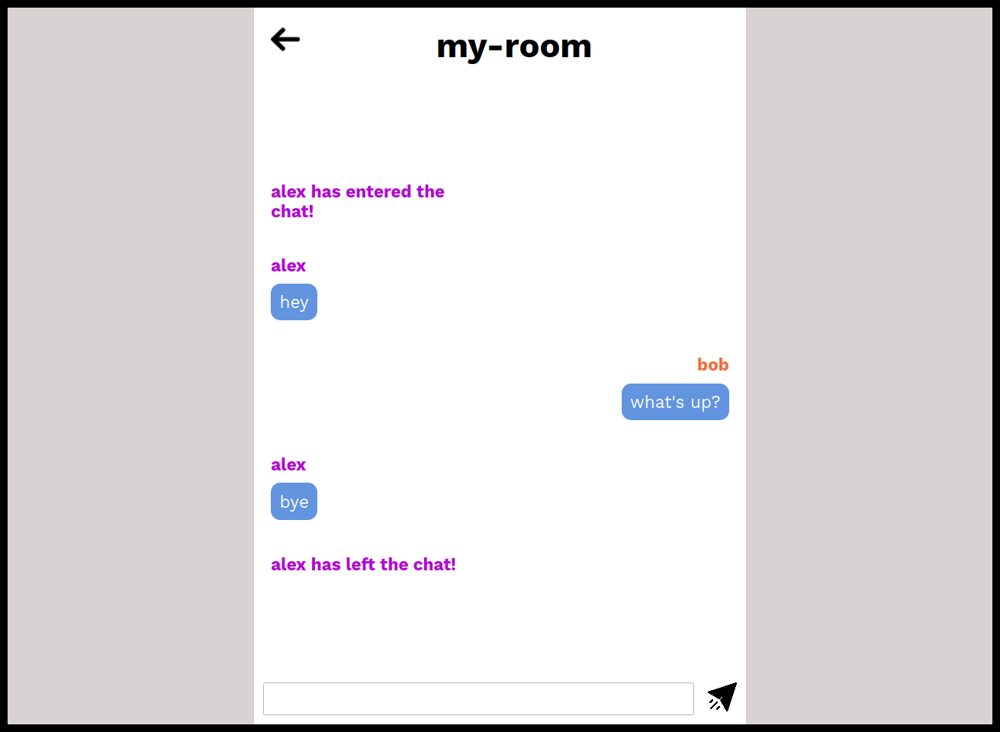

## react-chat  

A simple chat web app made using react and socket.io

Features

* [x] Create room  
* [x] Join room  
* [x] Leave room  
* [x] Colored usernames

## Running the project

### Frontend  

Create a `.env` file  

Specify your server address  

`REACT_APP_BASE_URL=YOUR_ADDRESS_HERE`  

`npm install && npm start`

### Backend

By default, the server runs at `PORT=3001`. You can change that by creating a `.env` file and setting the port number of your choice.

`npm install && npm run dev`

## Screenshots

  

